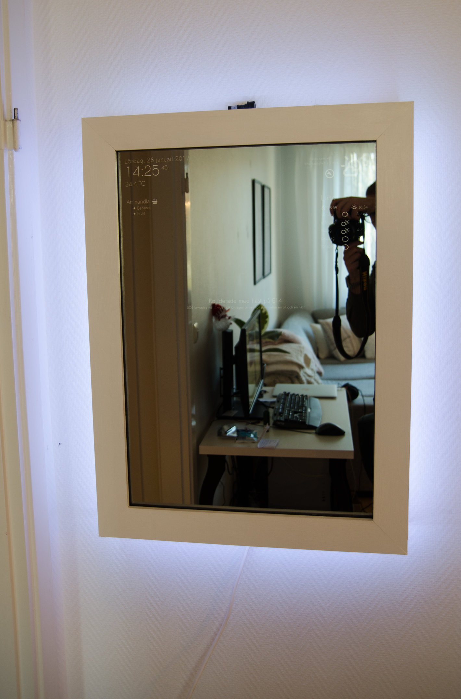
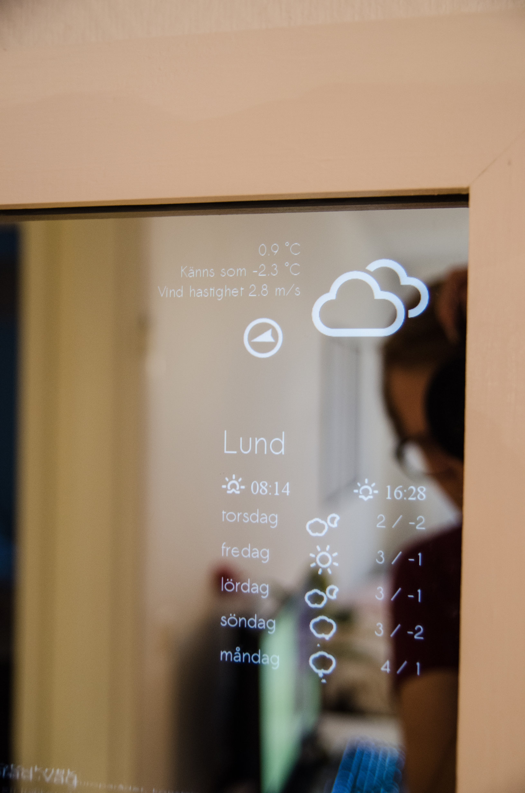
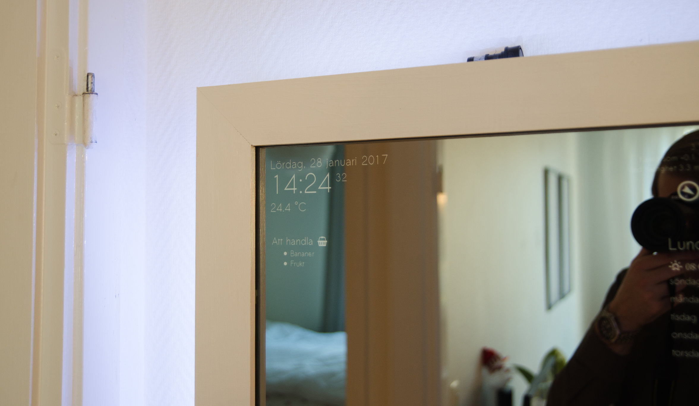
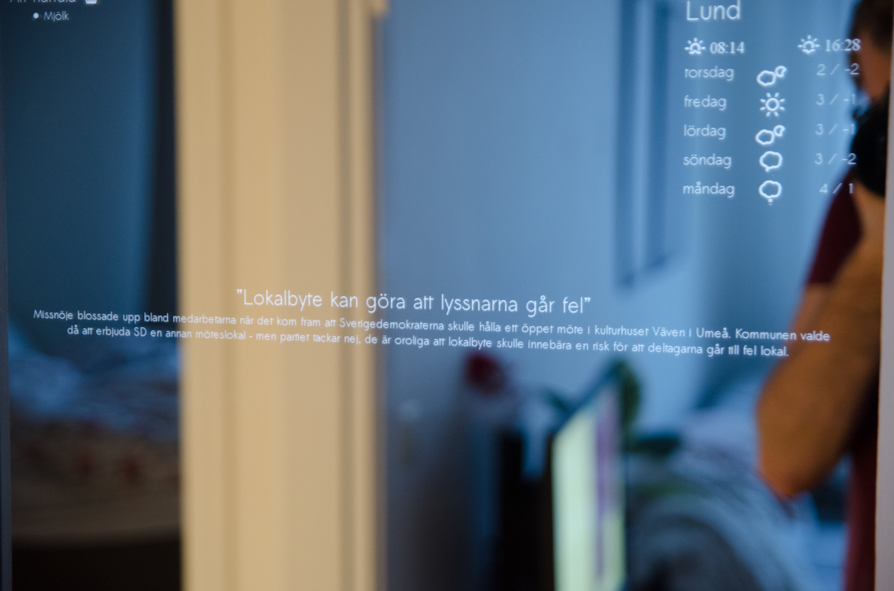
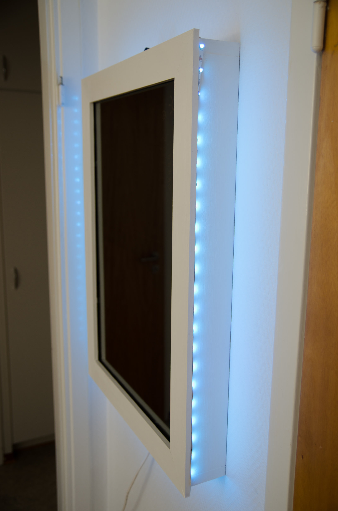
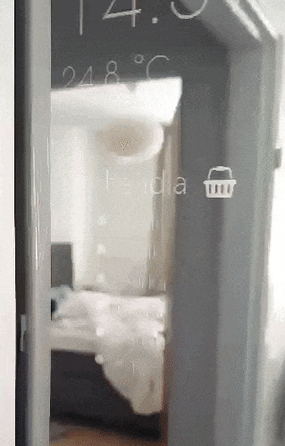

# SmartMirror

It's a Magic Mirror, you all know what it is. This is a complete rewrite in React and Node.js of my [original Magic Mirror](https://github.com/jakkra/MagicMirrorPi) written in Java. Everything is improved and it has lots of new functions.

Both voice recognition and the UI is in Swedish, currently I have no quick and easy support for changing to english.

## Features
**Voice Recognation using Google Cloud Speech**

Since Google Cloud Speech costs, I use [Snowboy](https://github.com/Kitt-AI/snowboy) to listen for my hotword "Spegel" or "Mirror" on english. When it's detected the Mirror records untill end of speech and sends it to Google Cloud Speech. 

* Create reminders on my [Home automation and monitoring backend](https://github.com/jakkra/OneBackendToRuleThemAll).
* Create tasks in a [Wunderlist](https://www.wunderlist.com/) list.
* Control Philips Hue Lights. Turn on and off individual lamps or all, for example "Turn the lights off in the bedroom" or similar.
* Hide/show individual elements on the Mirror
* Turning off the Mirror
* When reading articles/blogs you can skip to next article

All voice parsing is done very simple, however I tried to make all commands as dynamic as possible. My implementation is nothing fancy, but it works very well with the features I have right now. It looks for keywords in the spoken senetence and tries to extract it's meaning. Extending it with a lot of speech commands will most likely result in chaos. 

Reminders can be created in various ways (In Swedish, but translated here to english):

* Remind [me] in 20 minutes/hours/days to take a walk.
* Remind [me] to walk the dog in 2 minutes/hours/days.
* Remind [me] tomorrow at 12:35 to do the dishes.
* Remind [me] on **weekday** to wash the car.
* Remind [me] to buy/shop [more/extra] milk. // Adds it to a Wunderlist list (Shopping list in my case)

When a reminder is successfully created, the Mirror will speak something like "Will remind you to do X".

**Led strip**

Behind the Mirror I have a RGB led strip with individually controllable leds. The leds can be controlled from my [Home automation and monitoring app](https://github.com/jakkra/OneAppToRuleThemAll).

**Shopping list**

It displays the items on a Wunderlist list (in my case our shopping list).

**Weather**

Displays current weather including temperature outside, feels like temperature wind speed and direction.
Also sunrise/sunset and 5 day forecast.

**Inside temperature**

Which is retreived from a DS18B20 temperature sensor connected to the Raspberry PI running the Mirror.

**Motion detection**

Motion detection is retreived from a connected PIR motion detector connected to the Raspberry PI.
When motion is detected, a message will appear on the Mirror. It changes depending on the time of the day.
Also it notifies my [Home automation and monitoring backend](https://github.com/jakkra/OneBackendToRuleThemAll) that motion was detected, so my [Home automation and monitoring app](https://github.com/jakkra/OneAppToRuleThemAll) will notify me if I'm not at home and someone is in my apartment.

**Swedish news from SVT**

Headlines and short descriptions are changing in the bottom of the Mirror every 20 seconds or so.

## Images

 



 


## Running locally

### Create and fill in a .env file.
```
RuleThemAllBackendAccessToken=''
wunderlistAccessToken=''
wunderlistClientID=''
wunderlistListID='' // The ID of the list to fetch/create tasks in.

GOOGLE_APPLICATION_CREDENTIALS = '/home/user/../credentials.json'
GCLOUD_PROJECT = 'project_ID'

HUE_HOSTNAME='192.168.X.X' // Your bridge IP
HUE_USERNAME='username' // See https://github.com/peter-murray/node-hue-api

target='Krantz-Ubuntu' // Set to 'PI' on your Raspberry Pi. Avoids errors initializing gpio when not on Pi.
```

### Fill in client/config.js
```
export const config = {
	YAHOO_WOEID: '897819',
	SMHI_COORD: {
		longitude: '13.19',
		latitude: '55.7'
	},
	serverBaseURL: process.env.NODE_ENV === 'production' ? 'http://localhost:3001' : 'http://localhost:3000',
	wsServerBaseURL: process.env.NODE_ENV === 'production' ? 'localhost:3001/' : 'localhost:3001/'
};
```

### 

### Run it
```
git clone https://github.com/jakkra/SmartMirror.git
cd SmartMirror
npm i

cd client
npm i

cd ..
npm start
```

## Building

Running `npm run build` creates the static bundle.

```
cd client/
npm run build
```

## Solutions
Webpack doesn't reload when saving: 
```
$echo fs.inotify.max_user_watches=524288 | sudo tee -a /etc/sysctl.conf && sudo sysctl -p
```

Auto open chrome in SSH on RaspberryPi:
```
export DISPLAY=:0.0
npm start
```

## Useful commands
```
$ sudo apt-get install unclutter
$ unclutter -display :0.0 -idle 5 # Hides cursor after 5 seconds of inactivity

$ export DISPLAY=:0.0 # When starting chromium over SSH this must be done
$ chromium-browser --kiosk --incognito http://localhost:3001 # Launch Chromium in kiosk mode

$ sudo apt-get install -y fonts-tlwg-sawasdee # Installs the font I use.
```
